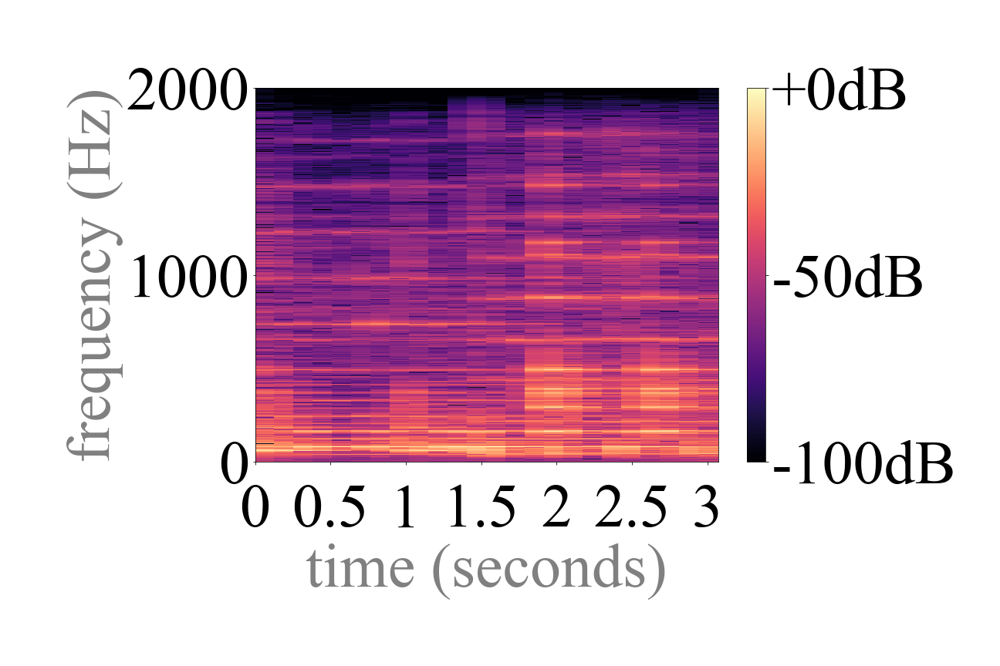
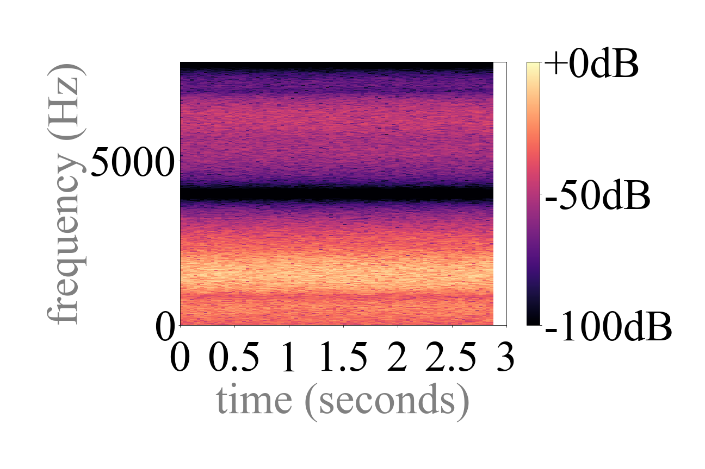

# Upsampling Artifacts in Neural Audio Synthesis

**[!] This article contains links to ipython notebooks where you can experiment with the figures below. All ipython notebooks are at: [Figures/](Figures/).**

A number of recent advances in neural audio synthesis rely on upsampling layers, which can introduce undesired artifacts. In computer vision, upsampling artifacts have been studied and are known as checkerboard artifacts (due to their characteristic visual pattern). However, their effect has been overlooked so far in audio processing. Here, we address this gap by studying this problem from the audio signal processing perspective. 

We first show that the main sources of upsampling artifacts are: (i) the tonal and filtering artifacts introduced by problematic upsampling operators, and (ii) the spectral replicas that emerge while upsampling. We then compare different upsampling layers, showing that nearest neighbor upsamplers can be an alternative to the problematic (but state-of-the-art) transposed and subpixel convolutions which are prone to introduce tonal artifacts.

## 1: Introduction

Feed-forward neural audio synthesizers **[1–4]** were recently proposed as an alternative to Wavenet **[5]**, which is computationally demanding and slow due to its dense and auto-regressive nature **[6]**. Among the different feed-forward architectures proposed for neural audio synthesis **[6–8]**, generative adversarial networks (GANs) **[1, 4, 9]** and autoencoders **[2, 3, 10]** heavily rely on upsampling layers. GANs allow for efficient feed-forward generation, by upsampling low-dimentional vectors to waveforms. Autoencoders also allow for feed-forward generation, and their bottleneck layers are downsampled – requiring less computational and memory footprint around the bottleneck. While GANs and autoencoders allow for fast feed-forward architectures, the upsampling layers that are typically embedded in these models can introduce upsampling artifacts **[1, 2]**.

Three main types of upsampling layers exist: transposed convolutions **[1, 3, 9]**, interpolation upsamplers **[2, 11]**, and subpixel convolutions **[10, 12, 13]**. These can introduce upsampling artifacts, as shown in Fig. 1—where we plot a spectrogram of their output after random initialization, to stress that upsampling artifacts are already present before training. We experiment with state-of-the-art neural synthesizers based on transposed convolutions (MelGAN and Demucs autoencoder) or on alternative upsampling layers (interpolation and subpixel convolutions). MelGAN uses transposed convolutions for upsampling **[4]**. We implement it as Kumar et al. **[4]**: with 4 transposed convolution layers of length=16,16,4,4 and stride=8,8,2,2 respectively. Demucs is an autoencoder employing transposed convolutions. We implement it as De ́fossez et al. **[3]**: with 6 transposed convolution layers of length=8 and stride=4. Transposed convolutions in MelGAN and Demucs introduce what we call “tonal artifacts” after initialization (Fig. 1: a, b, and Sec. 2). Next, we modify Demucs’ upsampling layers to rely on nearest neigbor interpolation **[14]** or subpixel convolution **[12]** upsamplers. Interpolation upsamplers can introduce what we describe as “filtering artifacts” (Fig. 1: c, and Sec. 3), while subpixel convolution can also introduce the above mentioned “tonal artifacts” (Fig. 1: d, and Sec. 4). 

In sections 2, 3 and 4, we describe the origin of these upsampling artifacts. In section 5, we note that spectral replicas can introduce additional artifacts. Finally, in section 6, we discuss the effect that training can have on such artifacts.

<table style="text-align: center;">
  <tr>
    <td align="center"></td>
    <td align="center"></td>
  </tr>
  <tr>
    <td style="text-align: center; font-size: 14px;"><b>MelGAN</b>: tonal artifacts (horizontal lines) after initialization.</td>
    <td style="text-align: center; font-size: 14px;"><b>Demucs</b>: tonal artifacts (horizontal lines) after initialization.</td>
  </tr>
  <tr>
    <td align="center"></td>
    <td align="center"></td>
  </tr>
  <tr>
    <td style="text-align: center; font-size: 14px;"><b>Nearest neighbor</b>: filtering artifacts (horizontal valleys) after initialization.</td>
    <td style="text-align: center; font-size: 14px;"><b>Subpixel convolution</b>: tonal artifacts (horizontal lines) after initialization.</td>
  </tr>
  <tr>
    <td align="center" colspan="2"><b>Fig. 1.</b> Upsampling artifacts after initialization: tonal artifacts (horizontal lines: a,b,d) and filtering artifacts (horizontal valley: c). Input: white noise. MelGAN operates at 22kHz, Demucs at 44.1kHz.</td>
  </tr> 
  <tr>
    <td align="center" colspan="2"><b>Code to experiment with these figures is at [Figures/Fig1_9.ipynb](Figures/Fig1_9.ipynb)</b></td>
  </tr>   
</table>

## 2: Transposed Convolutions

Transposed CNNs are widely used for audio synthesis **[1, 3, 9]** and can introduce tonal artifacts due to **[15]**: (i) their weights’ initialization, (ii) overlap issues, and (iii) the loss function. Issues (i) and (ii) are related to the model’s initialization and construction, respectively, while issue (iii) depends on how learning is defined. In this article, we use the terms length and stride for referring to the transposed convolution filter length and stride, respectively. Three situations arise:

* **No overlap**: length=stride. No overlap artifacts are introduced, but the weight initialization issue can introduce tonal artifacts.
* **Partial overlap**: length is not a multiple of stride. Overlap and weight initialization issues can introduce tonal and boundary artifacts. 
* **Full overlap**: length is a multiple of stride. Overlap artifacts can be introduced (as boundary artifacts at the borders) and the weight initialization issue introduces tonal artifacts after initialization. 

### Issue (i): Weight Initialization

It is caused by the transposed convolution weights that repeat across time, generating a periodic pattern (tonal artifacts) after random initialization. To understand this issue, we leave the overlap and loss function issues aside and consider an example of a randomly initialized transposed convolution with no overlap (length=stride=3, see Fig. 2). Given that the filter Wd is shared across time, the resulting feature map includes a periodicity related to the temporal structure of the (randomly initialized) weights. Fig. 2 (bottom) exemplifies this behavior by feeding ones to the above-mentioned transposed convolution: the temporal patterns present in the (random) weights introduce high-frequency periodicities that call to be compensated by training. Note that with stride=length, the emerging periodicities are dominated by the stride and length parameter. Solutions to this issue involve using constant weights or alternative upsamplers. Sections 3 and 4 focus on describing alternative upsamplers, since using constant weights can affect expressiveness — and learning due to a poor (constant) initialization.

<table style="text-align: center;">
  <tr>
    <td align="center"></td>
  </tr>
  <tr>
    <td align="center"><b>Fig. 2.</b> Transposed convolution: length=stride=3, w/o bias. The example depicts a periodicity every 3 samples, at the stride length. </td>
  </tr>   
</table>

### Issue (ii): Overlap

It arises because, when stride<length, the upsampled representations overlap and add. To understand this issue, we leave the weight initialization and loss function issues aside and consider constantly-initialized transposed convolutions with overlap (as in Figs. 3 and 4). Note that the stride>length setup is generally not desirable because parts of the upsampled signal are not defined. Due to the stride<length setup, upsampled representations overlap and add (see Figs. 3 and 4). This can cause different problems, depending on the situation: partial or full overlap.

* **Partial overlap**: length is not a multiple of stride. Upsampled representations are summed up (not averaged) and introduce a highfrequency periodicity to the signal. This behavior becomes clear if ones are fed to a length=3, stride=2 transposed convolution filter constantly initialized with ones (Fig. 3, bottom). A high-frequency pattern (tonal noise) emerges because the amount of overlap varies across the upsampled signal due to partial overlap. In addition, boundary artifacts emerge due to non-constant overlap at the borders.
* **Full overlap**: length is a multiple of stride. Overlap-related tonal artifacts are not present because the amount of overlap is constant across the upsampled signal. This behavior becomes clear if ones are fed to a length=3, stride=1 transposed convolution filter constantly initialized with ones (Fig. 4). While full overlap setups do not introduce overlap-related tonal artifacts, boundary artifacts emerge due to non-constant overlap at the borders. Fig. 4 depicts a full overlap setup (with stride=1) that barely upsamples the signal—but more effective full overlap configurations exist (see Fig. 5, row 3).

<table style="text-align: center;">
  <tr>
    <td align="center"></td>
  </tr>
  <tr>
    <td align="center"><b>Fig. 3.</b> Transposed convolution: length=stride=3, w/o bias. The example depicts a periodicity every 3 samples, at the stride length.</td>
  </tr>   
</table>

<table style="text-align: center;">
  <tr>
    <td align="center"></td>
  </tr>
  <tr>
    <td align="center"><b>Fig. 4.</b> Transposed convolution: length=stride=3, w/o bias. The example depicts a periodicity every 3 samples, at the stride length.</td>
  </tr>   
</table>

Fig. 5 (row 1) shows that high-frequencies emerge due to partial overlap, which can be avoided using a full overlap setup (row 3). However, as noted above, constant (ones) transposed convolution filters are rarely used. Fig. 5 (rows 2, 4) illustrates the effect of using non-constant filters. Note that even when using a full overlap setup, a periodic pattern appears at the frequency of the stride. Hence, importantly, the weight initialization issue remains. Also note that boundary artifacts are introduced in both cases: for partial and full overlap setups. Stoller et al. **[2]** also described boundary artifacts.

<table style="text-align: center;">
  <tr>
    <td align="center"></td>
  </tr>
  <tr>
    <td align="center" colspan="2"><b>Fig. 5.</b> Transposed convolutions, w/o bias, with input set as ones.</td>
  </tr>
  <tr>
    <td align="center" colspan="2"><b>Code to experiment with these figures is at [Figures/Fig5.ipynb](Figures/Fig5.ipynb)</b></td>
  </tr>  
</table>

### Issue (iii): Loss Function

Loss-related tonal artifacts can appear when using adversarial losses **[1]** and/or deep feature losses **[16]**, since using CNNs as a loss involves a transposed convolution in the backpropagation step that can cause high-frequency patterns in the gradient **[15]**. For example, loss-related high-frequency artifacts are noticeable when visualizing the learnt features of a neural network via optimization, since strided convolutions and pooling operations create high-frequency patterns in the gradient that impact the resulting visualizations **[17]**. Solutions proposed in the feature visualization literature involve relying on learnt priors **[19]** and/or regularizers **[20, 21]**. Alternative solutions may consist in not using losses that involve a backpropagation step that is a transposed convolution.

In the context of adversarial training, Donahue et al. **[1]** argued that high-frequency patterns are less common in images than in audio. Note that tonal artifacts may be similar to the (high) frequencies already present in real audio, which makes the discriminator’s objective more challenging for audio **[1]**. Accordingly, adversarial losses might be more effective at removing transposed convolution artifacts for images than for audio **[1]**. In addition, they also note that transposed convolution artifacts (tonal noise) will have a specific phase, allowing the discriminator to learn a trivial policy to detect fake audio. As a solution, they randomly perturb the phase of the discriminator’s feature maps **[1]**.

Finally, note that the loss function issue remains understudied for audio (but also for computer vision **[15, 25]**). Hence, the impact of training models with such losses has yet to be fully described.

## 3: Interpolation Upsamplers

Interpolation + convolution was proposed as an alternative to avoid transposed convolution artifacts **[15]**. It has been used, e.g., for music source separation **[2]**, speech enhancement **[22]** and neural vocoding **[14]**. While interpolation (e.g., linear or nearest neighbor) is effectively upsampling the signal, the subsequent convolution further transforms the upsampled signal with learnable weights. Hence, the problematic transposed convolution is replaced by interpolation + convolution with the goal to avoid the above-described tonal artifacts (see Fig. 6 or Odena et al. **[15]**). Its main downsides are: (i) interpolation + convolution upsamplers require two layers instead of a single tranposed convolution layer, which increases the memory and computational footprint of the upsampler; and (ii) it can introduce filtering artifacts. Observe the filtering artifacts in Fig. 6 and 8 (right): these de-emphasize the high-end frequencies of the spectrum. To understand filtering artifacts, note that interpolations can be implemented using convolutions — by first interpolating with zeros, an operator known as stretch **[23]**, and later convolving with a pre-defined (non-learnable) filter. Linear interpolations can be implemented with triangular filters, a sinc2(·) in the frequency domain; and nearest neighbor interpolation with rectangular filters, a sinc(·) in the frequency domain. The side lobes of the linear interpolation filter, sinc2(·), are lower than the nearest neighbor ones, sinc(·). For that reason, linear upsampling attenuates more the high-end frequencies than nearest neighbor upsampling (Fig. 6). Unless using learnable interpolation filters **[2]**, interpolation filters cannot be fine-tuned and additional layers (like its subsequent learnable convolution) will have to compensate, if necessary, for the frequency response of the interpolation filter that introduces filtering artifacts. Hence, filtering artifacts color **[24]** the signal and are introduced by the frequency response of the interpolation upsampler.

<table style="text-align: center;">
  <tr>
    <td align="center"></td>
    <td align="center"></td>
  </tr>
  <tr>
    <td style="text-align: center; font-size: 14px;"><b>Nearest neighbor interpolation</b>: input music signal.</td>
    <td style="text-align: center; font-size: 14px;"><b>Linear interpolation</b>: input (white) noise.</td>
  </tr>
  <tr>
    <td align="center"></td>
    <td align="center"></td>
  </tr>
  <tr>
    <td style="text-align: center; font-size: 14px;"><b>Nearest neighbor interpolation</b>: layer 1.</td>
    <td style="text-align: center; font-size: 14px;"><b>Linear interpolation</b>: layer 1.</td>  
  <tr>
    <td align="center"></td>
    <td align="center"></td>
  </tr>
  <tr>
    <td style="text-align: center; font-size: 14px;"><b>Nearest neighbor interpolation</b>: layer 2.</td>
    <td style="text-align: center; font-size: 14px;"><b>Linear interpolation</b>: layer 2.</td>
  </tr>
  <tr>
    <td align="center"></td>
    <td align="center"></td>
  </tr>
  <tr>
    <td style="text-align: center; font-size: 14px;"><b>Nearest neighbor interpolation</b>: layer 3.</td>
    <td style="text-align: center; font-size: 14px;"><b>Linear interpolation</b>: layer 3.</td>
  </tr>
  <tr>
    <td align="center" colspan="2"><b>Fig. 6.</b> Interpolation upsamplers: filtering artifacts, but no tonal
artifacts, after initialization. Each consecutive layer (top to bottom): 
nearest neighbor or linear interpolation (x2) + CNN (filters of length
9, stride 1). Inputs at 4kHz: music (left), white noise (right).</td>
  </tr>
  <tr>
    <td align="center" colspan="2"><b>Code to experiment with these figures is at [Figures/Fig6_left.ipynb](Figures/Fig6_left.ipynb) and [Figures/Fig6_right.ipynb](Figures/Fig6_right.ipynb)</b></td>
  </tr>   
</table>

## 4: SUBPIXEL CONVOLUTIONS

Based on convolution + reshape, subpixel CNN was proposed as an efficient1 upsampling layer **[25, 26]**. It has been used, e.g., for speech enhancement **[10]**, bandwidth extension **[12]** and voice conversion **[13]**. The convolution upsamples the signal along the channel axis, and reshape is an operation called periodic shuffle **[26]** that reorders the convolution output to match the desired (upsampled) output shape. Subpixel CNNs advantages are: (i) it avoids overlap issues by construction, since convolution + reshape constrain it to disallow overlapping; and (ii) it is computationally efficient because its convolutions operate over the original (non-upsampled) signal. main drawback is that it can introduce tonal artifacts via the periodic shuffle operator (see Fig. 7 or Aitken et al. **[25]**). Tonal artifacts emerge because it upsamples consecutive samples based on convolutional filters having different weights, which can cause periodic patterns **[25]**. Aitken et al. **[25]** proposed addressing these artifacts with an alternative initialization. However, nothing prevents these weights to degenerate into a solution that produces artifacts again — i.e., tonal artifacts can emerge during and after training.

<table style="text-align: center;">
  <tr>
    <td align="center"></td>
    <td align="center"></td>
  </tr>
  <tr>
    <td style="text-align: center; font-size: 14px;"><b>Input</b>: ones at 4kHz.</td>
    <td style="text-align: center; font-size: 14px;"><b>Subpixel convolution</b>: layer 1.</td>
  </tr>
  <tr>
    <td align="center"></td>
    <td align="center"></td>
  </tr>
  <tr>
    <td style="text-align: center; font-size: 14px;"><b>Subpixel convolution</b>: layer 2.</td>
    <td style="text-align: center; font-size: 14px;"><b>Subpixel convolution</b>: layer 3.</td>
  </tr>
  <tr>
    <td align="center" colspan="2"><b>Fig. 7.</b> Subpixel CNN: tonal artifacts after initialization. Each consecutive layer consists of a  CNN (w/ filters of length 3 and stride of 1) + reshape via the periodic shuffle operation (upsample x2)..</td>
  </tr> 
  <tr>
    <td align="center" colspan="2"><b>Code to experiment with these figures is at [Figures/Fig7.ipynb](Figures/Fig7.ipynb)</b></td>
  </tr>    
</table>

## 5: Spectral Replicas

Figs. 6, 7 and 8 are illustrative because several artifacts interact: (i) tonal and filtering artifacts introduced by problematic upsampling operations; and (ii) spectral replicas due to the bandwidth extension performed by each upsampling layer. From signal processing, we know that spectral replicas appear when discretizing a signal. Accordingly, when upsampling discrete signals one has to be vigilant of spectral replicas. Given that upsampling layers are effectively performing bandwidth extension, spectral replicas emerge while upsampling (see Fig. 6, left). Importantly, spectral replicas introduced by deeper layers (e.g., layers 2 & 3) also include replicas of the artifacts introduced by previous layers (e.g., layer 1 in Figs. 7 and 8):

* **Spectral replicas of tonal artifacts**. Upsampling tonal artifacts are introduced at a frequency of “sampling rate / upsampling factor”, the sampling rate being the one of the upsampled signal. For example: layer 1 outputs in Figs. 7 and 8 (left) are at a sampling rate of 8kHz, because the 4kHz input was upsampled x2. Accordingly, these upsampling layers introduce a tone at 4kHz. When upsampling with upcoming layers, the spectral replicas of previously introduced tones are exposed—plus the employed upsampler introduces new tones. In Figs. 7 and 8 (left), the spectral replicas (at 8, 12, 16 kHz) interact with the tones introduced by each layer (at 4, 8, 16 kHz).
* **Spectral replicas of filtering artifacts**. Similarly, filtering artifacts are also replicated when upsampling—see Figs. 1 (c), 6 (right), 8 (right). This phenomenon is clearer in Fig. 8 (right) because the interleaved convolutions in Fig. 6 (right) further color the spectrum.
* **Spectral replicas of signal offsets**. Deep neural networks can include bias terms and ReLU non-linearities, which might introduce an offset to the resulting feature maps. Offsets are constant signals with zero frequency. Hence, its frequency transform contains an energy component at frequency zero. When upsampling, zero-frequency components are replicated in-band, introducing audible tonal artifacts. These signal offset replicas, however, can be removed with smart architecture designs. For example, via using the filtering artifacts (introduced by interpolation upsamplers) to attenuate the spectral replicas of signal offsets. Fig. 8 (right) shows that linear (but also nearest neigbor) upsamplers attenuate such problematic frequencies, around “sampling rate / upsampling factor” where those tones appear. Further, minor modifications to Demucs (just removing the ReLUs of the first layer2 and the biases of the model) can also decrease the tonal artifacts after initialization (Fig. 1 vs. Fig. 9). While the modified Demucs architectures can still introduce tonal artifacts, via the problematic upsamplers that are used, the energy of the remaining tones is much less when compared to the tones introduced by the spectral replicas of signal offsets (Fig. 1 vs. Fig. 9). Note that mild tonal artifacts could be perceptually masked, since these are hardly noticeable under the presence of wide-band noise (Fig. 9).

In signal processing, spectral replicas are normally removed with low-pass filters **[23]**. Yet, upsampling layers are oftentimes stacked without those—so that upsamplers process the spectral replicas generated by previous upsampling layers **[2, 3]**. Note the effect of stacking upsamplers in Fig. 6: the model colors **[24]** the spectral replicas from previous layers. For wide-band synthesis, however, it seems natural to allow that high-frequencies are available along the model.

<table style="text-align: center;">
  <tr>
    <td align="center"></td>
    <td align="center"></td>
  </tr>
  <tr>
    <td style="text-align: center; font-size: 14px;"><b>Transposed convolution</b>: ones input signal.</td>
    <td style="text-align: center; font-size: 14px;"><b>Linear interpolation</b>: noise input signal.</td>
  </tr>    
  <tr>
    <td align="center"></td>
    <td align="center"></td>
  </tr>
  <tr>
    <td style="text-align: center; font-size: 14px;"><b>Transposed convolution</b>: layer 1.</td>
    <td style="text-align: center; font-size: 14px;"><b>Linear interpolation</b>: layer 1.</td>
  </tr>
  <tr>
    <td align="center"></td>
    <td align="center"></td>
  </tr>
  <tr>
    <td style="text-align: center; font-size: 14px;"><b>Transposed convolution</b>: layer 2.</td>
    <td style="text-align: center; font-size: 14px;"><b>Linear interpolation</b>: layer 1.</td>
  </tr>
  <tr>
    <td align="center"></td>
    <td align="center"></td>
  </tr>
  <tr>
    <td style="text-align: center; font-size: 14px;"><b>Transposed convolution</b>: layer 3.</td>
    <td style="text-align: center; font-size: 14px;"><b>Linear interpolation</b>: layer 1.</td>
  </tr> 
  <tr>
    <td align="center" colspan="2"><b>Fig. 8.</b> Transposed CNN, linear interpolation: tonal and filtering artifacts, after initialization. Transposed convolution layers:
length=4, stride=2. Linear interpolation layers: without the interleaved convolutions. Inputs at 4kHz: ones (left), white noise (right).</td>
  </tr> 
  <tr>
    <td align="center" colspan="2"><b>Code to experiment with these figures is at [Figures/Fig8_left.ipynb](Figures/Fig8_left.ipynb) and [Figures/Fig8_right.ipynb](Figures/Fig8_right.ipynb)</b></td>
  </tr>    
</table>

<table style="text-align: center;">
  <tr>
    <td align="center"></td>
    <td align="center"></td>
  </tr>
  <tr>
    <td style="text-align: center; font-size: 14px;">Demucs (original) modification.</td>
    <td style="text-align: center; font-size: 14px;">Demucs (subpixel convolution) modification..</td>
  </tr>
  <tr>
    <td align="center" colspan="2"><b>Fig. 9.</b> Demucs modification after initialization: no ReLUs in the first layer and no biases, to avoid spectral replicas of signal offsets.</td>
  </tr> 
  <tr>
    <td align="center" colspan="2"><b>[Code to experiment with these figures is at [Figures/Fig1_9.ipynb](Figures/Fig1_9.ipynb)]</b></td>
  </tr>    
</table>

## 6: The role of training

So far, we discussed that upsampling artifacts emerge because upsampling operators with problematic initializations are stacked one on top of another. However, nothing prevents the model from learning to compensate such artifacts. While some did not use, e.g., transposed CNNs to avoid tonal artifacts **[2, 22]** — others aim at learning to correct these problematic initializations via training **[3, 10]**. We found that most speech upsamplers are based on transposed CNNs, with just a few exceptions **[10, 14, 22]**. Only from the speech literature, we were unable to assess the impact of training one upsampler or another. Yet, music source separation works provide additional insights. WaveUnets (autoencoders based on linear upsamplers) are widely used, but their performance is poor compared to state-of-the-art models: ≈3 vs. ≈5 dB SDR (signal-to-distortion ratio), see Table 1. However, Demucs (a modified waveUnet relying on transposed convolutions) achieved competitive results: ≈5 dB SDR. According to the literature, then, it seems that transposed CNNs are preferrable: these are widely used and achieve competitive results.

Here, we further study the role of learning when training neural upsamplers under comparable conditions. We study Demucs-like models with 6 encoding blocks (with strided CNN, ReLU, GLU) and 6 decoding blocks (with GLU, full overlap transposed CNN, ReLU), connected via skip connections [3], with two LSTMs in the bottleneck (3200 units each). Strided and transposed convolution layers have 100, 200, 400, 800, 1600, 3200 filters of length=8 and stride=4, respectively **[3]**. For our experiments, we change the transposed convolutions in Demucs for the different upsampling layers listed in Table 1 (top). Like the original Demucs, we use: very large models, of ≈700M parameters **[3]**; weight rescaling, so that input and output signals are of the same magnitude after initialization **[3]**; and their data augmentation schema, creating new mixes on-the-fly **[3, 27]**. We also use the MUSDB **[28]** benchmark, that is composed of stereo songs at 44.1 kHz. For each song, four stereo sources are extracted: vocals, bass, drums, other. In Table 1 we report the average signal-to-distorion ratio (SDR) over all sources **[29]**. We optimize the L1 loss with Adam **[30]** for 600 epochs at a learning rate of 0.0002 (0.0001 for the modified subpixel CNN) with x4 v100 GPUs, using a batch size of 32. 

Despite their architectural issues and poor initialization, transposed and subpixel CNNs achieve the best SDR scores (see Table 1). However, differently from what the literature conveys, interpolation-based models follow closely—with nearest neighbor upsamplers obtaining the best results. The proposed modifications (without strong tones after initialization, see Fig. 9) perform similarly to their poorly initialized counterparts. These results unveil the role of training: it helps overcoming the noisy initializations, caused by the problematic upsampling operators, to get state-of-the-art results. Informal listening, however, reveals that tonal artifacts can emerge even after training, especially in silent parts and with out-of-distribution data (e.g., with sounds and conditions not seen during training). We find that nearest neighbor and linear interpolation models do not have this disadvantage, although they achieve worse SDR scores.

<table style="font-size: 14px;">
<thead>
  <tr>
    <th>Music source separation (MUSDB benchmark)</th>
    <th>SDR (dB) ↑</th>
    <th>epoch</th>
    <th># param</th>
  </tr>
</thead>
<tbody>
  <tr>
    <td>Demucs-like (Fig. 1, b): transposed CNN (full-overlap)</td><td>5.35</td><td>319 s</td><td>703M</td>
  </tr>
  <tr>
    <td>Demucs-like (Fig. 1, c): nearest neighbor interpolation</td><td>5.17</td><td>423 s</td><td>716M</td>
  </tr>
  <tr>
    <td>Demucs-like: linear interpolation</td><td>4.62</td><td>430 s</td><td>716M</td>
  </tr>
  <tr>
    <td>Demucs-like (Fig. 1, d): subpixel CNN</td><td>5.38</td><td>311 s</td><td>729M</td>
  </tr>
  <tr>
    <td>Modified (Fig. 9, a): transposed CNN (full-overlap)</td><td>5.37</td><td>326 s</td><td>703M</td>
  </tr>
  <tr>
    <td>Modified (Fig. 9, b): subpixel CNN</td><td>5.38</td><td>315 s</td><td>729M</td>
  </tr>
  <tr>
    <td>WaveUnet <b>[2]</b>: linear intepolation</td><td>3.23</td><td>-</td><td>10M</td>
  </tr>  
  <tr>
    <td>Demucs <b>[3]</b>: transposed convolution (full-overlap)</td><td>5.34</td><td>-</td><td>648M</td>
  </tr>
  <tr>
    <td>OpenUnmix <b>[31]</b>: spectrogram-based</td><td>5.36</td><td>-</td><td>8.9M</td>
  </tr>
  <tr>
    <td>Sams-net <b>[32]</b>: spectrogram-based</td><td>5.65</td><td>-</td><td>3.7M</td>
  </tr>
</tbody>
</table>

## 7: SUMMARY & REMARKS

Upsamplers are a key element for developing computationally efficient and high-fidelity neural audio synthesizers. Given their importance, together with the fact that the audio literature only provides sparse and unorganized insights **[1,2,4,10]**, our work is aimed at advancing and consolidating our current understanding of neural upsamplers. We discussed several sources of tonal artifacts: some relate to the transposed convolution setup or weight initialization, others to architectural choices not related to transposed convolutions (e.g., with subpixel CNNs), and others relate to the way learning is defined (e.g., with adversarial or deep feature losses). While several works assume to resolve the tonal artifacts via learning from data, others looked at alternative possibilities which, by construction, omit tonal artifacts—these include: interpolation upsamplers, that can introduce filtering artifacts. Further, upsampling artifacts can be emphasized by deeper layers via exposing their spectral replicas. 

We want to remark that any transposed convolution setup, even with full or no overlap, produces a poor initialization due to the weights initialization issue. Further, subpixel CNNs can also introduce tonal artifacts. In both cases, training is responsible to compensate for any upsampling artifact. Finally, the interpolation upsamplers we study do not introduce tonal artifacts, what is perceptually preferable, but they achieve worse SDR results and can introduce filtering artifacts.

## REFERENCES

**[1]** Chris Donahue, Julian McAuley, and Miller Puckette, “Adversarial audio synthesis,” in ICLR, 2019.

**[2]** Daniel Stoller, Sebastian Ewert, and Simon Dixon, “Wave-unet: A multi-scale neural network for end-to-end audio source
separation,” ISMIR, 2018.

**[3]** Alexandre Défossez, Nicolas Usunier, Léon Bottou, and Francis Bach, “Music source separation in the waveform domain,”
arXiv, 2019.

**[4]** Kundan Kumar, Rithesh Kumar, Thibault de Boissiere, Lucas
Gestin, Wei Zhen Teoh, Jose Sotelo, Alexandre de Brébisson,
Yoshua Bengio, and Aaron C Courville, “Melgan: Generative
adversarial networks for conditional waveform synthesis,” in
NeurIPS, 2019.

**[5]** Aaron van den Oord, Sander Dieleman, Heiga Zen, Karen Simonyan, Oriol Vinyals, Alex Graves, Nal Kalchbrenner, Andrew Senior, and Koray Kavukcuoglu, “Wavenet: A generative
model for raw audio,” arXiv, 2016.

**[6]** Dario Rethage, Jordi Pons, and Xavier Serra, “A wavenet for
speech denoising,” in ICASSP, 2018.

**[7]** Ryan Prenger, Rafael Valle, and Bryan Catanzaro, “Waveglow: A flow-based generative network for speech synthesis,”
in ICASSP, 2019.

**[8]** Joan Serrà, Santiago Pascual, and Carlos Segura Perales,
“Blow: a single-scale hyperconditioned flow for non-parallel
raw-audio voice conversion,” in NeurIPS, 2019.

**[9]** Santiago Pascual, Antonio Bonafonte, and Joan Serrà, “Segan:
Speech enhancement generative adversarial network,” Interspeech, 2017.

**[10]** Ashutosh Pandey and DeLiang Wang, “Densely connected
neural network with dilated convolutions for real-time speech
enhancement in the time domain,” in ICASSP, 2020.

**[11]** Mikolaj Binkowski, Jeff Donahue, Sander Dieleman, Aidan
Clark, Erich Elsen, Norman Casagrande, Luis C Cobo, and
Karen Simonyan, “High fidelity speech synthesis with adversarial networks,” in ICLR, 2019.

**[12]** Volodymyr Kuleshov, S Zayd Enam, and Stefano Ermon, “Audio super resolution using neural networks,” arXiv, 2017.

**[13]** Ju-chieh Chou, Cheng-chieh Yeh, Hung-yi Lee, and Lin-shan
Lee, “Multi-target voice conversion without parallel data
by adversarially learning disentangled audio representations,”
arXiv, 2018.

**[14]** Alexey A Gritsenko, Tim Salimans, Rianne van den Berg,
Jasper Snoek, and Nal Kalchbrenner, “A spectral energy distance for parallel speech synthesis,” arXiv, 2020.

**[15]** Augustus Odena, Vincent Dumoulin, and Chris Olah, “Deconvolution and checkerboard artifacts,” Distill, vol. 1, no. 10, pp.
e3, 2016.

**[16]** Francois G Germain, Qifeng Chen, and Vladlen Koltun,
“Speech denoising with deep feature losses,” Interspeech,
2019.

**[17]** Chris Olah, Alexander Mordvintsev, and Ludwig Schubert,
“Feature visualization,” Distill, vol. 2, no. 11, pp. e7, 2017.

**[18]** Keunwoo Choi, George Fazekas, Mark Sandler, and Jeonghee
Kim, “Auralisation of deep convolutional neural networks:
Listening to learned features,” ISMIR late-breaking/demo,
2015.

**[19]** Anh Nguyen, Alexey Dosovitskiy, Jason Yosinski, Thomas
Brox, and Jeff Clune, “Synthesizing the preferred inputs for
neurons in neural networks via deep generator networks,” in
NeurIPS, 2016.

**[20]** Aravindh Mahendran and Andrea Vedaldi, “Understanding
deep image representations by inverting them,” in CVPR, 2015.

**[21]** Alexander Mordvintsev, Christopher Olah, and Mike Tyka,
“Inceptionism: Going deeper into neural networks,” Google
Research Blog, 2015.

**[22]** Ritwik Giri, Umut Isik, and Arvindh Krishnaswamy, “Attention wave-u-net for speech enhancement,” in WASPAA, 2019.

**[23]** Julius Orion Smith, Mathematics of the discrete Fourier transform (DFT): with audio applications, Julius Smith, 2007.

**[24]** Jordi Pons, Olga Slizovskaia, Rong Gong, Emilia Gómez, and
Xavier Serra, “Timbre analysis of music audio signals with
convolutional neural networks,” in EUSIPCO, 2017.

**[25]** Andrew Aitken, Christian Ledig, Lucas Theis, Jose Caballero,
Zehan Wang, and Wenzhe Shi, “Checkerboard artifact free
sub-pixel convolution: A note on sub-pixel convolution, resize
convolution and convolution resize,” arXiv, 2017.

**[26]** Wenzhe Shi, Jose Caballero, Ferenc Husz´ar, Johannes Totz,
Andrew P Aitken, Rob Bishop, Daniel Rueckert, and Zehan
Wang, “Real-time single image and video super-resolution using an efficient sub-pixel convolutional neural network,” in
CVPR, 2016.

**[27]** Stefan Uhlich, Marcello Porcu, Franck Giron, Michael Enenkl,
Thomas Kemp, Naoya Takahashi, and Yuki Mitsufuji, “Improving music source separation based on deep neural networks through data augmentation and network blending,” in
ICASSP, 2017.

**[28]** Zafar Rafii, Antoine Liutkus, Fabian-Robert Stöter,
Stylianos Ioannis Mimilakis, and Rachel Bittner, “The
MUSDB18 corpus for music separation,” 2017.

**[29]** Emmanuel Vincent, Rémi Gribonval, and Cédric Févotte,
“Performance measurement in blind audio source separation,”
IEEE Transactions on Audio, Speech, and Language Processing, vol. 14, no. 4, pp. 1462–1469, 2006.

**[30]** Diederik P Kingma and Jimmy Ba, “Adam: A method for
stochastic optimization,” arXiv, 2014.

**[31]** Fabian-Robert Stöter, S. Uhlich, A. Liutkus, and Y. Mitsufuji,
“Open-unmix - a reference implementation for music source
separation,” Journal of Open Source Software, 2019.

**[32]** Haowen Hou Ming Li Tingle Li, Jiawei Chen, “Sams-net: A
sliced attention-based neural network for music source separation,” arXiv, 2019.
